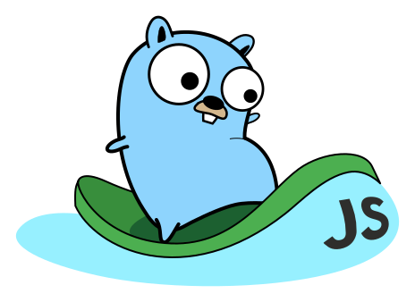
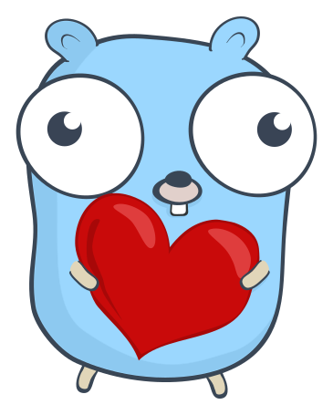

[%3CSystem.out.println(%22hello+Java~%22);%3Cfmt.Println(%22hello+golang~%22)%3Cprint(%22hello+Python~%22)>)](https://git.io/typing-svg)

<!-- TAGS -->

    
    

<!-- TAGS -->

<!-- 

 -->

<!--   my-header-go-img   -->

<!--   my-header-img -->

# 🏹 Main Skills

<!-- go run gif -->

  

<!-- go run gif -->

<!-- tools & technologies   -->

# 🧨 My favorite tools and technologies

<table align="center">
  <tr>
    <td align="center" width="96">
        
       React
    </td>
    <td align="center" width="96">
        
       Vue
    </td>
    <td align="center" width="96">
      
       Python
    </td>
    <td align="center" width="96">
        
       JavaScript
    </td>
    <td align="center" width="96">
        
       Webpack
    </td>
    <td align="center" width="96">
        
       TypeScript
    </td>
    <td align="center" width="96">
        
       C#
    </td>
  </tr>
  <tr>
    <td align="center" width="96">
        
       Django
    <td align="center" width="96">
        
       Github
    </td>
    <td align="center" width="96"> 
        
       Git
    </td>
    <td align="center"  width="96">
        
       HTML5
    </td>
    <td align="center" width="96">
        
       CSS
    </td>
    <td align="center" width="96">
        
       Tailwind
    </td>
    <td align="center" width="96">
        
       jQuery
    </td>
  </tr>
  <tr>
    <td align="center" width="96">
        
       MongoDB
    </td>
      <td align="center" width="96">
        
         Nodejs
      </td>
      </td>
      <td align="center" width="96">
        
       PHP
      </td>
            <td align="center" width="96">
        
       VsCode
    </td>
      <td align="center" width="96">
        
       Sass
    </td>
    <td align="center" width="96">
        
       PostgreSQL
    </td>
    <td align="center" width="96">
        
       MySQL
    </td>
 </tr>
</table>

 
<!-- tools & technologies   -->

<!-- run 图片 -->

  
  <!--  分割  -->
  

<!-- run 图片 -->

 

# 🎨 Data graph

  
  

<!-- activity graph heroku-app start -->

    

<!-- kunming - My Home-->

# 🧡 Thanks for visiting

<!-- VISIT -->

 

<!--  -->

<!-- VISIT -->

[MIT](LICENSE)

<!-- footer 图片 -->

<!-- footer 图片 -->
